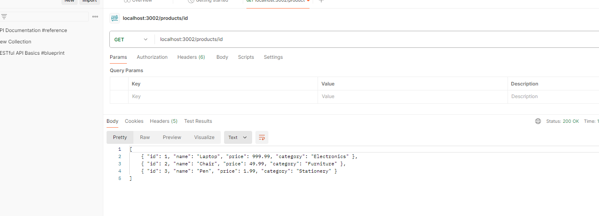

# uso de metodo HTTP 

Esta es la docomentacion de mi API
que toma datos de un archivo externo y lo muestra en .json y lo muestra en la interfas de potsman

-------------------

necesitaria ayuda para hacer que me busque por id, o la verdad fue mas por escases de tiempo.

Pero interesante me rete llamarlo por archivo externo y lo logre !!!!!